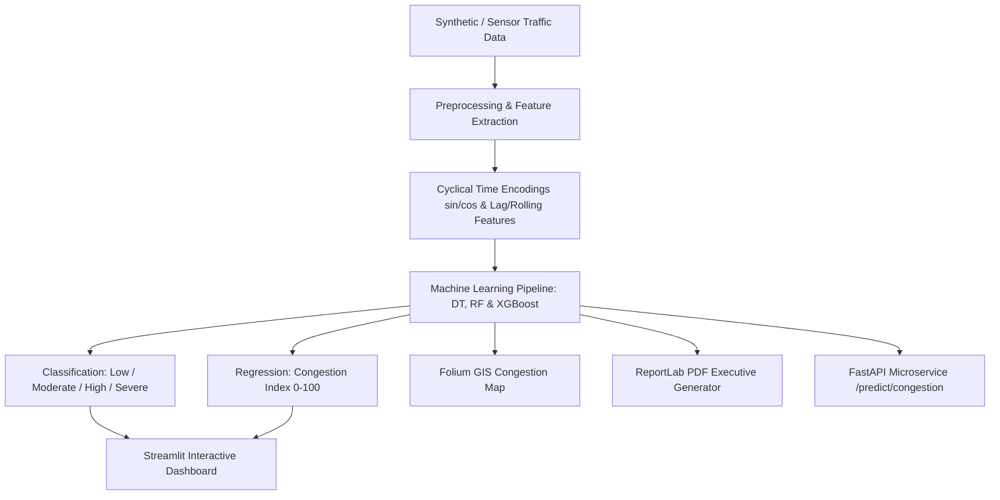

# 🚦 IntelliTraffic

**AI-Based Intelligent Traffic Analytics & Congestion Prediction System**

[](https://www.python.org/)
[](https://streamlit.io/)
[](https://fastapi.tiangolo.com/)
[](https://xgboost.readthedocs.io/)
[](LICENSE)

---

## 🎯 Main Purpose of the Project

Traffic congestion in urban centers leads to increased travel times, economic loss, heightened fuel consumption, and environmental pollution. **IntelliTraffic** is an end-to-end AI/ML framework designed to:

1. **Monitor Real-Time Traffic Density**: Aggregate spatio-temporal vehicle counts, average speeds, and weather conditions across city junctions.
2. **Predict Traffic Congestion Levels**: Classify traffic status into **Low**, **Moderate**, **High**, or **Severe** and estimate a numerical **Congestion Index (0–100)** using high-precision machine learning models (**XGBoost**, **Random Forest**, **Decision Tree**).
3. **GIS Spatio-Temporal Mapping**: Visualize live junction congestion on interactive **Folium** maps color-coded by severity (🟢 **Green = Low**, 🟡 **Yellow = Moderate**, 🔴 **Red = High/Severe**).
4. **Automate Traffic Control Recommendations**: Suggest dynamic signal green-light extensions and traffic re-routing diversions based on live AI predictions.
5. **Automated Reporting & REST API Integration**: Generate executive PDF reports using **ReportLab** and expose real-time prediction microservices via **FastAPI**.

---

## 🏗️ System Architecture & Workflow



---

## 📁 Project Directory Structure

```
IntelliTraffic/
│
├── api/
│   └── main.py                     # FastAPI REST microservice endpoints (/predict, /health)
│
├── config/
│   ├── __init__.py
│   └── settings.py                 # Centralized configuration & directory paths
│
├── dashboard/
│   └── app.py                      # Multi-tab Streamlit interactive web application
│
├── data/
│   ├── raw/                        # Raw traffic observations CSV
│   ├── processed/                  # Cleaned & feature-engineered dataset CSV
│   └── generate_data.py            # Spatio-temporal traffic data generator
│
├── models/
│   ├── decision_tree_classifier.joblib
│   ├── random_forest_classifier.joblib
│   ├── xgboost_classifier.joblib   # Top Classification Model (99.31% Accuracy)
│   ├── xgboost_regressor.joblib    # Top Regression Model (0.9959 R²)
│   ├── label_encoder.joblib
│   ├── scaler.joblib
│   ├── feature_names.joblib
│   └── metrics_summary.json        # Machine learning benchmark metrics
│
├── reports/
│   ├── traffic_summary_report.pdf  # Automated ReportLab executive summary PDF
│   └── IntelliTraffic_Complete_Project_Documentation.pdf # Full project manual PDF
│
├── tests/
│   └── test_pipeline.py            # Automated unittest test suite (100% Pass Rate)
│
├── utils/
│   ├── __init__.py
│   ├── preprocessing.py            # Cleaning, sine/cos encodings, lag & rolling features
│   ├── model_utils.py              # ML model training, cross-validation & evaluation
│   ├── visualization.py            # Plotly interactive charts & Folium GIS map generator
│   └── report_generator.py        # ReportLab PDF report creation module
│
├── generate_project_pdf_docs.py    # Generator for comprehensive project manual PDF
├── train_models.py                 # End-to-end ML model training & artifact exporter
├── main.py                         # Starter data generation & preprocessing script
├── requirements.txt                # Python package dependencies
├── README.md                       # Complete project documentation
└── LICENSE                         # MIT License
```

---

## 📊 Machine Learning Performance Benchmarks

Models were trained and evaluated on 2,880 spatio-temporal traffic observations across city junctions:

| Model Architecture | Classification Accuracy | Precision | Recall | F1 Score | Regression $R^2$ | MAE |
| :--- | :---: | :---: | :---: | :---: | :---: | :---: |
| ⚡ **XGBoost** *(Recommended)* | **0.9931 (99.31%)** | **0.9931** | **0.9931** | **0.9931** | **0.9959** | **0.8037** |
| 🌲 **Random Forest** | **0.9844 (98.44%)** | **0.9847** | **0.9844** | **0.9844** | **0.9946** | **0.8872** |
| 🌳 **Decision Tree** | **0.9844 (98.44%)** | **0.9848** | **0.9844** | **0.9844** | **0.9863** | **1.3411** |

---

## 🛠️ Technologies Used

- **Core**: Python 3.9+
- **Data Engineering**: Pandas, NumPy, Scikit-Learn
- **Machine Learning**: XGBoost, Scikit-learn (Random Forest, Decision Tree), Joblib
- **Interactive Visualizations**: Plotly, Folium (Geospatial Mapping)
- **Web Dashboard**: Streamlit, HTML5/CSS3 (Plus Jakarta Sans typography, Glassmorphism UI)
- **RESTful API Microservice**: FastAPI, Uvicorn, Pydantic
- **PDF Report Generation**: ReportLab
- **Automated Testing**: Python `unittest`

---

## 🚀 Step-by-Step Installation & Running Guide

### 1. Clone the Repository
```bash
git clone https://github.com/Dhruv-Prajapati1708/AI-Based-Intelligent-Traffic-Analytics-Congestion-Prediction-System.git
cd AI-Based-Intelligent-Traffic-Analytics-Congestion-Prediction-System
```

### 2. Create & Activate Virtual Environment
```bash
# On Windows:
python -m venv venv
venv\Scripts\activate

# On macOS/Linux:
python3 -m venv venv
source venv/bin/activate
```

### 3. Install Dependencies
```bash
pip install -r requirements.txt
```

---

### 🏃 Running Project Components

#### Step A: Run Data Pipeline & Preprocessing
Generates raw synthetic traffic data and builds feature-engineered preprocessed datasets:
```bash
python main.py
```

#### Step B: Train Machine Learning Models
Trains Decision Tree, Random Forest, and XGBoost models, evaluates metrics, and saves artifacts into `models/`:
```bash
python train_models.py
```

#### Step C: Launch Interactive Streamlit Dashboard
Launches the web dashboard featuring executive analytics, GIS maps, AI predictors, and report downloaders:
```bash
streamlit run dashboard/app.py
```
> Access the web dashboard at: `http://localhost:8501`

#### Step D: Start RESTful FastAPI Microservice
Starts the FastAPI server for real-time API prediction requests:
```bash
uvicorn api.main:app --reload
```
> Access interactive Swagger API documentation at: `http://localhost:8000/docs`

#### Step E: Generate PDF Summary & Manual Reports
Generates automated executive summary PDF reports:
```bash
python utils/report_generator.py
python generate_project_pdf_docs.py
```
> Generated PDFs saved at: `reports/traffic_summary_report.pdf` & `reports/IntelliTraffic_Complete_Project_Documentation.pdf`

#### Step F: Run Automated Unit Tests
Verifies data generation, feature shapes, model inference, and API endpoints:
```bash
python -m unittest tests/test_pipeline.py
```

---

## 💡 REST API Endpoint Usage Example

### Predict Congestion via `POST /predict/congestion`
```bash
curl -X 'POST' \
  'http://127.0.0.1:8000/predict/congestion' \
  -H 'Content-Type: application/json' \
  -d '{
  "junction_id": "Junction_1",
  "hour": 8,
  "day_of_week": "Monday",
  "weather_condition": "Clear",
  "temperature_c": 25.0,
  "vehicle_count": 350,
  "average_speed_kmh": 32.0,
  "model_name": "XGBoost"
}'
```

#### Sample Response:
```json
{
  "junction_id": "Junction_1",
  "predicted_congestion_level": "High",
  "predicted_congestion_index": 72.4,
  "model_used": "XGBoost",
  "recommendation": "High congestion detected! Recommend activating dynamic diversion routes and extending green cycle."
}
```

---

## 📜 License

This project is open-source and licensed under the [MIT License](LICENSE).
